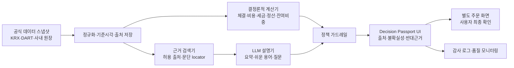

# 카카오페이증권 초보 투자자 매수·매도 지원 시스템 리서치 보고서 — Codex 독립본

- 기준일: 2026-07-16 (KST)
- 조사 범위: 초보 투자자 정의, 카카오페이증권 전략·서비스·기술, 투자자 행동·VOC, 벤치마크, 규제·접근성, 데이터·구현 가능성
- 조사 원칙: 사실(F)·해석(I)·가설(H)·제품 결정(D) 분리, 모든 핵심 근거에 출처 ID와 딥링크 부착
- 독립성: 이 보고서와 Codex 출처·주장대장을 동결하기 전까지 Claude의 보고서·출처대장·주장대장을 열람하지 않았습니다.
- 주의: 본 문서는 제품 리서치이며 투자 권유나 개별 법률의견이 아닙니다. 실제 금전 거래는 수행하지 않았습니다.
- 제공 입력: [X-SRC-0001 본선 안내](../notice/2026-07-18_본선안내_카카오페이증권트랙.md), [X-SRC-0003 인터뷰 영상 분석](./2026-07-16_카카오페이증권_인터뷰영상분석.md)

## 0. 결론부터

### 0.1 문제 재정의

이 문제는 **“AI가 최적 매수·매도 시점을 알려주는 문제”가 아닙니다.** 다음과 같이 재정의하는 편이 인터뷰의 평가 기준, 국내 투자자 행동근거, 소비자보호, 카카오페이증권의 방향에 동시에 부합합니다.

> **가격 변동과 손실 때문에 판단이 흔들리는 경험 부족 투자자가, 최신 사실·자신의 원래 계획·주문 결과를 이해하고 스스로 설명 가능한 결정을 내리도록 돕는 문제입니다.**

출제 인터뷰도 수학적 최적점보다 사용자가 “납득하고 안심하여 다음 행동을 실행”할 수 있는 정보와 해답을 만드는 과정의 설계를 강조합니다. [X-SRC-0002](https://www.youtube.com/watch?v=aBuoojGjyf4)

### 0.2 최우선 타깃

최우선 타깃은 단순히 `20대`, `소액 계좌`, `신규 계좌`가 아닙니다. 아래 조건 가운데 하나 이상을 충족하면서 현재 보유 종목의 손실·변동으로 매도 판단이 막힌 이용자입니다.

- 생애 첫 현물주식 체결 후 12개월 이하인 `신규 진입자`
- 활동월·체결일·완료된 매수-매도 경험이 적은 `실전경험 부족자`
- 주문·비용·세금·결제·변동성·분산에 관한 객관지식이 낮은 `지식 초보자`
- 투자근거·최대 감수손실·주문규모·청산조건을 독립적으로 정하기 어려운 `저효능 초보자`

`12개월`과 지식·자기효능감의 절단값은 법정 기준이 아니라 파일럿에서 검증할 연구 설계안입니다. 현물주식 투자자 전반에 적용되는 법정 “초보 투자자” 등급은 확인되지 않았고, 투자경험은 적합성 파악 요소 가운데 하나입니다. [X-SRC-0215](https://law.kofia.or.kr/service/law/detailArticlePrint.do?contentSeq=294183&historySeq=1743&seq=149)

### 0.3 권고 제품: `판단 여권(Decision Passport)`

핵심 데모는 출처 기반 대화형 코파일럿 `판단 여권`입니다.

1. **매수 전 계획 기록:** “왜 사는가, 언제 다시 볼 것인가, 무엇이 틀리면 재검토할 것인가, 감수 가능한 손실은 얼마인가”를 쉬운 문장으로 남깁니다.
2. **보유 중 사실 점검:** 가격 변동 원인, 공시·실적, 집중도, 데이터 기준시각을 원래 계획과 대조합니다.
3. **대칭 시나리오:** 유지·부분매도·전량매도 결과를 같은 시각적 비중으로 보여주되 순위를 매기지 않습니다.
4. **주문 영향 미리보기:** 사용자가 직접 입력한 수량에 대해 예상 체결금액, 수수료·세금·환전, 실현손익, 잔여 수량, 결제·출금 가능일을 계산합니다.
5. **이해 확인과 분리된 실행:** AI 대화 안에 즉시 매수·매도 버튼을 두지 않고, 별도 주문 화면에서 이용자가 최종 확인합니다.
6. **사후 회고:** 주문 이유와 재검토일을 기록해 다음 판단의 기준으로 사용합니다.

이 설계는 Betterment의 주문 전 세금 영향 미리보기, Vanguard의 `Assess–Address–Audit` 행동 코칭, 토스증권의 가격변동 맥락 설명을 결합하되 단정적 추천과 게임화를 제거한 형태입니다. [X-SRC-0420](https://www.betterment.com/help/how-tax-impact-preview-works) [X-SRC-0423](https://advisors.vanguard.com/behavioral-coaching) [X-SRC-0401](https://www.tossinvest.com/ai-campaign)

### 0.4 기대 임팩트

성공은 거래횟수나 단기수익률 증가가 아닙니다. 제품의 1차 임팩트는 다음과 같습니다.

- 사용자: 비용·위험·주문 결과 이해도, 판단근거 설명 가능성, 과업 성공률, 계획과 행동의 일치율 향상
- 소비자보호: 출처 없는 주장, 중요 위험 누락, 오주문, 오래된 데이터 오인 감소
- 비즈니스: 주문·결제·평단·시세 문의의 셀프서비스 해결, 민원 감소, 신뢰에 기반한 건강한 유지율 향상

## 1. 조사 방법과 근거 품질

### 1.1 근거 등급

| 등급 | 정의 | 이 보고서의 예 |
|---|---|---|
| A | 법령·감독기관·공식 통계·원논문·공시 | 자본시장법, KCMI 계좌자료 연구, KRX·DART |
| B | 회사 공식 기능·IR·도움말 | 카카오페이증권 뉴스룸, Betterment 도움말 |
| C | 앱 리뷰·커뮤니티·보조언론 | Google Play 리뷰, Reddit 게시물 |

회사 공식 자료는 **기능의 존재와 회사 의도**에는 강한 근거지만, 회사가 주장하는 성과의 인과효과에는 독립 검증이 아닙니다. 앱 리뷰는 발견 근거로만 사용하며 테마 비율을 전체 고객 비율로 일반화하지 않습니다.

출처대장의 `published_at`이 `undated`인 항목은 동적 페이지에서 발행일을 확인하지 못한 경우이며, `accessed_at_kst`로 조회 시점을 고정했습니다. 동일 연구의 소개 페이지와 원문 PDF가 모두 있는 경우 정식 페이지를 `url`, PDF 딥링크를 `locator`에 기록했습니다.

### 1.2 VOC 표본

Google Play의 한국어 최신 리뷰 5,000건씩을 수집한 뒤 2025-07-16 이후 투자 관련 키워드가 있는 리뷰를 필터링했습니다. 카카오페이 앱 80건, 토스 앱 40건을 평점과 기간에 따라 층화했고 4~5점 리뷰 26건을 포함했습니다. 원문 전체와 사용자명은 저장하지 않고 리뷰 ID, 날짜, 평점, 딥링크, 20단어 이하 발췌만 보존했습니다. [VOC 표본](./evidence/2026-07-17_초보투자자_VOC표본_codex.csv)

- 24건의 체계적 층화 재검수에서 투자 맥락 적합성은 24/24였습니다.
- 자동 다중테마와 사람 판정이 최소 한 테마에서 일치한 사례는 23/24, 95.8%였습니다.
- 추가 표적검수에서 타 앱을 잘못 귀속한 1건과 `번호가`의 부분 문자열을 `호가`로 오인한 1건을 발견해 기각했습니다.
- 최종 분석 대상은 118건(카카오페이 79, 토스 39)입니다. 원자료 120건과 기각 사유는 삭제하지 않고 남겼습니다.

한계는 Google Play 단일 플랫폼, 슈퍼앱 리뷰의 혼합 맥락, 자발적 리뷰의 자기선택 편향, 키워드 필터의 누락 가능성입니다. 따라서 아래 건수는 **표본 안에서 반복 관찰된 신호**일 뿐 발생률이나 경쟁사 우열이 아닙니다.

### 1.3 주요 한계

- 앱 로그인 후 실제 주문 여정을 직접 조작하거나 금전 거래하지 않았습니다.
- 한국의 전국 단위 조사에서 `초보 주식투자자의 주문 직전 불안`을 직접 측정한 통계는 찾지 못했습니다.
- 휴리스틱 검토가 본안이며 실사용자 과업 테스트는 수행하지 않았습니다.
- 2026년 8월 이후 시행 예정인 법 개정은 실제 출시 시점에 다시 확인해야 합니다.
- 본선 당일 상세 요구사항이 이 보고서와 충돌하면 당일 공지를 우선해야 합니다.

## 2. 초보 투자자는 누구인가

### 2.1 한 가지 대리변수로 정의하면 안 되는 이유

KCMI의 2021년 연구는 2020년 3월 이후 조사 대상 증권사에 계좌를 만든 투자자를 `신규 투자자`로 정의했습니다. 전체 204,004명 중 60,446명, 29.6%였지만, 이는 생애 최초 투자자가 아니라 증권사 신규계좌이므로 이동 고객이 섞일 수 있습니다. [X-SRC-0201](https://www.kcmi.re.kr/report/report_view?report_no=1243)

동 연구에서 신규 투자자의 77.4%가 1천만원 이하 계좌였고 젊은 층·소액계좌의 거래빈도가 높았지만, 연령과 자산은 취약성의 상관변수이지 초보 여부 그 자체가 아닙니다. 성별 역시 초보자 라벨로 사용해서는 안 됩니다. [X-SRC-0201](https://www.kcmi.re.kr/report/report_view?report_no=1243) [X-SRC-0214](https://faculty.haas.berkeley.edu/odean/papers/gender/boyswillbeboys.pdf)

### 2.2 권고 조작적 정의

| 축 | 운영 측정 | 용도 |
|---|---|---|
| 진입기간 | 생애 최초 현물주식 체결일로부터 경과개월 | 신규 진입 여부 |
| 실전경험 | 활동월, 체결일, 라운드트립 수, 사용한 주문유형 | 실행 경험 |
| 객관지식 | 주문·비용·세금·결제·변동성·분산·공시 8~12문항 | 설명 난이도·보호 수준 |
| 자기효능감 | 근거·손실한도·규모·청산조건을 스스로 정할 수 있는지 4~6문항 | 판단 지원 필요도 |
| 행동취약 | 회전율, 보유기간, 집중도, 군집매수, PGR/PLR | 사후 안전 신호 |

제품 내부에서는 단일 `초보/숙련` 라벨 대신 `신규 진입`, `역량 초보`, `행동 취약`을 별도 필드로 보존해야 합니다. 지식 점수는 낮지만 자신감은 높은 과잉확신형도 저효능형과 다른 메시지가 필요합니다. 자기효능감 축은 청년의 일반 재무관리행동 연구에서 인접근거를 얻었을 뿐, 주식 주문 자기효능감을 직접 측정한 근거는 아닙니다. [X-SRC-0207](https://www.kci.go.kr/kciportal/ci/sereArticleSearch/ciSereArtiView.kci?sereArticleSearchBean.artiId=ART003083999) 이는 제품 가설(D)이며 파일럿에서 6·12·24개월 기준과 점수 절단값의 민감도를 검증해야 합니다.

### 2.3 의사결정 순간별 세그먼트

| 세그먼트 | 근거 강도 | 포함 여부 | 이유 |
|---|---:|---:|---|
| 첫 매수 준비형 | 중 | 포함 | 정보 과부하·용어 이해·비용 이해 문제를 공식 조사와 리뷰가 지지합니다. |
| 보유 중 손실불안형 | 중 | 핵심 | 인터뷰가 직접 지목하고 손실·후회 관련 행동연구와 VOC가 보조합니다. 다만 불안의 전국 유병률은 미확인입니다. |
| 매도 판단 막막형 | 중상 | 핵심 | 처분효과, 주문영향 불확실성, 매도 실패·평단·정산 VOC가 교차 지지합니다. |
| 매도 후 재진입형 | 낮음 | 백로그 | 커뮤니티 사례는 있으나 국내 직접 근거와 회사 VOC가 부족합니다. |

## 3. 문제의 정량·이론 근거

### 3.1 한국 계좌자료가 보여주는 문제

KCMI의 코로나19 국면 표본에서 보고서 산식상 신규 투자자의 거래비용 반영 전·후 수익률은 5.9%와 -1.2%, 기존 투자자는 18.8%와 15.0%였습니다. 신규 투자자의 시장 대비 초과수익률은 비용 전 -10.5%, 비용 후 -17.6%였고, 손실 투자자 비중은 신규 60%, 기존 36%였습니다. 이는 특정 2020년 급락·반등기와 네 개 증권사 표본이라는 한계가 있습니다. [X-SRC-0201](https://www.kcmi.re.kr/report/report_view?report_no=1243)

같은 계좌자료의 후속 연구에서 평균 보유기간은 9.67일, 중앙값은 3일이었습니다. 보유 첫날 수익 종목의 매도비율은 41%, 손실 종목은 22%였고, 통제 회귀에서는 신규 투자자의 처분효과가 더 강했습니다. 이 결과는 행동 패턴을 보여주지만 그 원인이 불안·손실회피·기대수익 신념 중 무엇인지는 식별하지 않습니다. [X-SRC-0202](https://www.kcmi.re.kr/report/report_view?report_no=1481)

MTS 이용자는 신규·젊은·소액 투자자에게 많고 표본상 초과수익률이 낮았지만, 연구자는 투자자 선택효과와 채널의 인과효과를 구분하기 어렵다고 명시합니다. 따라서 “모바일 앱이 충동매매를 일으킨다”는 확정 사실이 아니라 검증할 가설입니다. [X-SRC-0203](https://www.kcmi.re.kr/publications/pub_detail_view?cno=5857&syear=2022&zcd=002001016&zno=1642)

### 3.2 지식과 행동의 간극

한국금융소비자보호재단의 2025 펀드 투자자 조사에서 모바일·PC 이용자의 69.3%·66.4%가 약관·설명서를 열어보기만 하거나 대략 읽었고, 주요 이유는 많은 분량과 어려운 용어였습니다. 10개 객관문항 정답률은 51.3%였으며 20대는 44.2%였습니다. 이는 펀드·ETF 투자자 조사이므로 현물주식 초보자 비율로 일반화할 수 없지만, 긴 설명서만 제공해서는 이해가 확보되지 않는다는 강한 인접근거입니다. [X-SRC-0204](https://www.kfcpf.or.kr/front/evalution/reportingView.do?rpIdx=3967)

2024 전국민 금융이해력 조사에서 20대의 객관지식은 전체와 유사했지만 금융행동 점수는 더 낮았습니다. 일반 성인 조사이므로 투자자 표본은 아니지만 `지식 전달만으로 행동이 개선된다`는 가정을 경계하게 합니다. [X-SRC-0206](https://eiec.kdi.re.kr/policy/materialView.do?num=266065&topic=)

### 3.3 행동재무학의 설명력과 한계

- 전망이론은 준거점과 손실영역의 위험추구를 설명하지만 가상 선택실험 중심이며 한국 초보자의 실제 주문 증거가 아닙니다. [X-SRC-0210](https://www.ucl.ac.uk/anaesthesia/sites/anaesthesia/files/kahneman-tversky.pdf)
- 처분효과 이론은 이익 종목을 너무 빨리 팔고 손실 종목을 오래 보유하는 경향을 설명합니다. [X-SRC-0211](https://people.bath.ac.uk/mnsrf/Teaching%202011/Shefrin-Statman.pdf)
- 미국 할인증권사 계좌자료에서도 연중 이익실현비율 0.148, 손실실현비율 0.098이 관찰됐지만 미국의 1987~1993년 세제·시장 맥락입니다. [X-SRC-0212](https://faculty.haas.berkeley.edu/odean/Papers%20current%20versions/AreInvestorsReluctant.pdf)
- 미국 66,465가구 자료에서 거래가 가장 많은 집단의 연 순수익률은 11.4%, 시장은 17.9%였지만 과잉확신은 계좌자료에서 직접 측정한 변수가 아닙니다. [X-SRC-0213](https://faculty.haas.berkeley.edu/odean/papers/returns/individual_investor_performance_4-99.pdf)

따라서 제품은 `손실회피가 원인이다`라고 진단하지 않고 불안·예상후회·현금 필요·원래 계획·집중도를 별도로 질문해야 합니다.

## 4. VOC: 초보자가 실제 화면에서 막히는 지점

### 4.1 반복 관찰된 신호

정제 표본에서는 카카오페이 리뷰에서 주문 실행, 신뢰성·장애, 탐색·표시, 정보 설명이 반복됐고, 토스 리뷰에서는 탐색·표시, 주문 실행, 정산·비용, 보유내역이 반복됐습니다. 서비스별 수집·필터 조건과 슈퍼앱 맥락이 달라 건수를 서로 비교해서는 안 됩니다.

대표 사례는 다음과 같습니다.

- ETF 종목 설명이 없어 상품 정체를 이해하기 어렵다는 리뷰 [X-SRC-03001](https://play.google.com/store/apps/details?id=com.kakaopay.app&hl=ko&gl=KR&reviewId=4f40c6f1-5afd-402d-a6f6-b60755583901)
- ISA 투자까지 여러 경로와 반복 검색이 필요하다는 리뷰 [X-SRC-03003](https://play.google.com/store/apps/details?id=com.kakaopay.app&hl=ko&gl=KR&reviewId=a65292de-fa71-4612-a235-5b7f44a52fce)
- 소수점 주문이 10분 뒤 체결되어 가격과 취소 가능성을 알기 어렵다는 리뷰 [X-SRC-03010](https://play.google.com/store/apps/details?id=com.kakaopay.app&hl=ko&gl=KR&reviewId=fbe8615a-ab66-453d-bf57-d1d598cf1d2f)
- 매도 버튼이 보이지 않는 동안 가격이 하락해 손실 불안이 커졌다는 리뷰 [X-SRC-03022](https://play.google.com/store/apps/details?id=com.kakaopay.app&hl=ko&gl=KR&reviewId=c5f14fb3-8019-4f87-a080-c320d6da0a0e)
- 예수금 위치를 일주일 동안 찾지 못했다는 리뷰 [X-SRC-03048](https://play.google.com/store/apps/details?id=com.kakaopay.app&hl=ko&gl=KR&reviewId=685ba4ad-d88e-48a6-8905-14c5a3af79af)
- 종목별 매수·매도 이력을 보고 싶다는 긍정 리뷰 [X-SRC-03066](https://play.google.com/store/apps/details?id=com.kakaopay.app&hl=ko&gl=KR&reviewId=ac0542b7-cd0b-48cc-b4b5-0953c1cad0a4)
- 토스 이용자가 종목별·월별 추가매수 합계와 배당 관점을 함께 보고 싶다고 제안한 리뷰 [X-SRC-03111](https://play.google.com/store/apps/details?id=viva.republica.toss&hl=ko&gl=KR&reviewId=9704c68f-12e1-424e-b62f-3b7532fdda5c)

### 4.2 사용자 여정으로 재분류

| 순간 | 사용자의 실제 질문 | 현재 정보 공백 | 제품 기회 |
|---|---|---|---|
| 발견 | “이 종목·ETF가 정확히 무엇인가?” | 이름·테마는 있으나 상품구조·위험 설명이 약함 | 쉬운 설명 + 원문·기준일 |
| 매수 직전 | “내가 누른 가격에 체결되는가?” | 주문유형·체결시점·환전·비용 불확실 | 주문 영향 미리보기 |
| 보유 중 | “왜 수익률·평단이 이렇게 보이는가?” | 장중·정규장·환율·정산 기준 혼재 | 계산식과 기준시각 공개 |
| 손실 발생 | “지금 팔아야 하나?” | 가격 변화와 원래 계획이 분리됨 | 계획 회상 + 대칭 시나리오 |
| 매도 직전 | “팔면 실제로 얼마가 남고 언제 쓸 수 있나?” | 실현손익·세금·시장별 결제일·잔여 비중 분산 | 결과 미리보기 |
| 장애 | “주문이 됐나, 지금 무엇을 해야 하나?” | 주문상태·영향범위·복구시각 불명확 | 고객용 상태·안전모드 |
| 매도 후 | “왜 그렇게 결정했나?” | 판단근거가 사라져 같은 실수 반복 | 이유·재검토일 기록 |

### 4.3 핵심 JTBD

> 변동성 때문에 불안해졌을 때, 누군가의 결론을 따르는 대신 내 계획과 최신 사실, 주문 후 결과를 한 화면에서 비교하여 내가 감당할 수 있는 결정을 내리고 싶습니다.

## 5. 카카오페이증권의 방향과 현재 서비스

### 5.1 회사가 해결하려는 문제

카카오페이증권은 회사 소개에서 플랫폼을 통해 투자 진입장벽을 낮추고 누구나 쉽게 투자할 수 있는 환경을 지향한다고 설명합니다. 리테일 사업도 카카오페이 연결성, 쉬운 투자 경험, 일상 속 자산관리를 핵심으로 제시합니다. 이는 이번 과제의 `초보 투자자의 판단 지원`과 직접 맞닿습니다. [X-SRC-0101](https://www.kakaopaysec.com/company/about/dynamicPage.do) [X-SRC-0102](https://www.kakaopaysec.com/business/retail/dynamicPage.do)

2026년 1분기 실적자료에서 카카오페이는 증권 부문의 월간 거래 고객과 거래대금 증가를 강조했고, 카카오페이증권은 2026년 3월 월간 거래 고객 140만 명, 주식 거래대금 79.2조 원, 금융자산 13조 원이라고 발표했습니다. 이는 회사 발표·잠정 실적 성격이므로 감사를 마친 시장 통계와 구분해야 합니다. 이후 보도자료의 금융자산 15조 원·20조 원도 서로 다른 기준일의 성장 이정표이지 동일 시점 수치가 아닙니다. [X-SRC-0103](https://www.kakaopay.com/ir/ir_archive/earnings_release) [X-SRC-0104](https://kind.krx.co.kr/external/2026/05/14/001075/20260514002342/11013.htm) [X-SRC-0111](https://www.kakaopaysec.com/company/news_page/dynamicNewsDetail.do?id=111) [X-SRC-0112](https://www.kakaopaysec.com/company/news_page/dynamicNewsDetail.do?id=116)

경영진 메시지는 향후 축을 `AI 기반 투자정보`, `커뮤니티`, `프로 투자자 경험`으로 설명합니다. 투자매매업 인가, 연금·ISA, RIA, 신용·대출 등 서비스 외연도 넓히고 있습니다. 그러므로 본선 제안은 단순 주문 편의 기능보다 **정보를 이해하고, 다른 사람의 의견을 검토하며, 최종 판단을 안전하게 실행하는 공통 의사결정 계층**이어야 회사의 확장 방향과 잘 맞습니다. [X-SRC-0105](https://www.kakaopaysec.com/company/news_page/dynamicNewsDetail.do?id=110) [X-SRC-0106](https://www.kakaopaysec.com/company/news_page/dynamicNewsDetail.do?id=119) [X-SRC-0113](https://www.kakaopaysec.com/company/news_page/dynamicNewsDetail.do?id=114) [X-SRC-0114](https://www.kakaopaysec.com/company/news_page/dynamicNewsDetail.do?id=115)

### 5.2 현재 제공 범위와 이번 과제의 빈틈

| 현재 범위 | 확인한 기능·방향 | 남은 의사결정 공백 |
|---|---|---|
| 탐색·정보 | 종목·차트·시세, 실시간 해외 실적 번역, AI 투자정보, 리서치 | 정보의 출처·기준시각·상반된 근거를 한 판단 단위로 묶는 장치 |
| 매수·매도 | 차트 주문, 호가 주문, 바로 주문, 수익률 기준 모으기·팔기 | 주문 전 비용·체결·정산·잔여 위험의 통합 미리보기 |
| 반복 투자 | 주식 모으기, 소수점 투자 | 시장가·일괄 체결·환전 방식과 실제 체결가 불확실성 설명 |
| 자산관리 | 펀드, 연금, ISA, RIA, 신용·대출 | 여러 계좌와 상품에 걸친 계획·위험 기준의 연속성 |
| 사회적 정보 | 투자자 커뮤니티, 카카오톡 채널 | 인기와 근거를 구분하고 군집행동을 완화하는 안전장치 |
| 고객보호 | FAQ, 민원·소비자보호 포털, 투자 유의사항 | 주문 순간에 필요한 고지와 장애 상태를 맥락 안에서 노출 |

근거: [X-SRC-0107](https://www.kakaopaysec.com/company/news_page/dynamicNewsDetail.do?id=120) [X-SRC-0108](https://www.kakaopaysec.com/company/news_page/dynamicNewsDetail.do?id=105) [X-SRC-0109](https://www.kakaopaysec.com/company/news_page/dynamicNewsDetail.do?id=92) [X-SRC-0110](https://www.kakaopaysec.com/company/news_page/dynamicNewsDetail.do?id=98) [X-SRC-0115](https://www.kakaopaysec.com/company/news_page/dynamicNewsDetail.do?id=107) [X-SRC-0116](https://www.kakaopaysec.com/company/news_page/dynamicNewsDetail.do?id=118)

현재 공개 웹 정보만으로 실제 앱의 최신 전 여정을 확정할 수는 없습니다. 공식 이용안내도 별도 확인이 필요합니다. 예를 들어 해외 시세는 거래소·종목에 따라 실시간 또는 15분 지연으로 전환될 수 있으므로, 주문 판단 화면에서 `현재 가격`이라는 한 단어로 뭉개면 안 됩니다. 수수료·계좌·이자 지급 방식도 화면별 문구의 최신성과 적용 조건을 점검해야 합니다. [X-SRC-0119](https://www.kakaopaysec.com/guide/account/dynamicPage.do) [X-SRC-0120](https://www.kakaopaysec.com/guide/feeGuide/dynamicPage.do) [X-SRC-0121](https://www.kakaopaysec.com/guide/quotation/dynamicPage.do)

### 5.3 기술·조직 신호에서 얻은 설계 원칙

공식 기술 글에서는 Kubernetes·멀티클러스터, Kafka·Redis·MongoDB, 관측성 플랫폼, 클라우드 비용 관리, 사내 RAG·LLM 봇과 상담지원 AI를 확인할 수 있습니다. 이는 실시간 금융 시스템을 운영하면서 AI를 별도 서비스가 아니라 기존 업무·데이터 흐름에 접목하는 역량을 보여주는 **기술 방향의 신호**입니다. 특정 채용 공고와 기술 글은 실제 본선 구현 의무 스택을 뜻하지 않습니다. [X-SRC-0132](https://tech.kakaopay.com/post/pallas-v2-log-platform/) [X-SRC-0134](https://tech.kakaopay.com/post/multi-cluster/) [X-SRC-0136](https://tech.kakaopay.com/post/choonsiri/) [X-SRC-0137](https://tech.kakaopay.com/post/ifkakao2024-dr-pym-project/) [X-SRC-0139](https://tech.kakaopay.com/post/kakaopaysec-redis-on-kubernetes/) [X-SRC-0140](https://tech.kakaopay.com/post/kakaopaysec-mongodb-cdc/)

AI 에이전트 기획·업무 플랫폼 에이전트·UX 리더 채용 공고는 에이전트 경험, 평가 체계, human-in-the-loop, 제품 전반의 UX 품질을 중시한다는 신호입니다. 따라서 제안 시스템도 다음 원칙을 따릅니다. [X-SRC-0128](https://career.kakaopaysec.com/job_posting) [X-SRC-0129](https://career.kakaopaysec.com/job_posting/tAw6vPWv) [X-SRC-0130](https://career.kakaopaysec.com/job_posting/h6XYO0i5) [X-SRC-0131](https://career.kakaopaysec.com/job_posting/tEYpf3mm)

- 계산·주문 상태·규제 판단은 결정론적 서비스가 담당합니다.
- LLM은 근거가 붙은 사실을 쉬운 언어로 바꾸고 질문을 정리하는 데만 사용합니다.
- 모든 답변은 출처, 기준시각, 계산식, 불확실성을 함께 반환합니다.
- 고위험 행동에는 사람의 최종 확인과 즉시 중단 수단을 둡니다.
- 로그에는 모델 답변뿐 아니라 입력 데이터 버전·정책 버전·사용자 선택을 연결합니다.

## 6. 벤치마크에서 취할 것과 버릴 것

| 서비스·자료 | 취할 패턴 | 주의하거나 버릴 패턴 | 본 제안에의 적용 |
|---|---|---|---|
| 토스증권 | 자연어로 `왜 움직였는지` 맥락을 설명하고 간결하게 탐색 | AI 정보가 투자권유가 아니라는 고지와 실제 출처 품질을 별도 검증해야 함 | 종목 설명을 `무슨 회사/오늘 변화/확인할 원문`으로 구조화 |
| 핀트·에임 | 목표·위험성향을 먼저 묻고 장기 계획을 보여주는 UX | 투자일임·자문 모델을 일반 중개 화면의 자동 주문에 그대로 옮길 수 없음 | 목표 질문과 계획 회상만 차용, 실행은 분리 |
| 미래에셋 M-STOCK | 다양한 주문·정보 기능을 한 플랫폼에 통합 | 기능 밀도가 초보자의 이해를 자동 보장하지 않음 | 초보 모드에서는 단계적 공개와 용어 풀이 |
| Robinhood | 주문 검토 단계와 반복 투자 설정 | 인기 목록·축하 효과·마찰 없는 반복 클릭은 과잉거래를 자극할 위험 | 애니메이션 보상 대신 결과·위험 검토를 완료 신호로 사용 |
| Magnifi | 자연어 투자 검색과 비교 | 미국 등록 투자자문사라는 규제 맥락이 다름 | 검색·요약 UI만 참고하고 개인화 결론은 금지 |
| Betterment | 거래 전 세금 영향 미리보기, 자동 리밸런싱의 이유 설명 | 관리형 포트폴리오와 직접 주식 주문은 권한·책임이 다름 | 비용·세금·잔여 비중의 대칭 미리보기 |
| Vanguard | Assess–Address–Audit 행동 코칭, 패닉 매도 연구 | 집단 평균을 개인 예측으로 사용하면 안 됨 | 감정 진단보다 계획·목표·사후 검토 질문으로 전환 |

출처: [X-SRC-0401](https://www.tossinvest.com/ai-campaign) [X-SRC-0403](https://www.tossinvest.com/investment-disclaimers) [X-SRC-0404](https://www.fint.co.kr/) [X-SRC-0407](https://getaim.co/invest) [X-SRC-0412](https://trading.securities.miraeasset.com/imf/200/imf201.do) [X-SRC-0413](https://robinhood.com/us/en/support/articles/recurring-investments/) [X-SRC-0417](https://magnifi.com/product) [X-SRC-0420](https://www.betterment.com/help/how-tax-impact-preview-works) [X-SRC-0422](https://www.betterment.com/help/portfolio-rebalancing-methods) [X-SRC-0423](https://advisors.vanguard.com/behavioral-coaching)

Robinhood 사례는 특히 반면교사입니다. FINRA는 시스템·감독·고객 커뮤니케이션 문제 등에 대해 제재했고, 매사추세츠 주 당국의 동의명령은 게임화·디지털 참여 관행을 다룹니다. 단순한 화면이나 축하 애니메이션 하나가 곧 위법이라는 뜻은 아니지만, 거래 횟수를 성공지표로 삼는 설계의 위험은 공식 제재 기록으로 뒷받침됩니다. [X-SRC-0415](https://www.sec.state.ma.us/divisions/securities/download/RH-Consent-Order.pdf) [X-SRC-0416](https://www.finra.org/sites/default/files/2021-06/robinhood-financial-awc-063021.pdf)

벤치마크를 종합하면 좋은 초보자 UX는 클릭 수가 가장 적은 UX가 아니라, **핵심 결과를 먼저 보여주고 필요할 때 계산·원문·반대 근거까지 한 단계씩 펼칠 수 있는 UX**입니다.

## 7. 규제·소비자보호·접근성 경계

### 7.1 기능별 허용 경계

| 구역 | 기능 예 | 설계 판단 |
|---|---|---|
| 녹색 | 공시·시세의 중립 요약, 용어 설명, 사용자가 정한 수량의 비용 계산, 과거 계획 회상, 가상 시나리오 | MVP 기본 범위. 출처·기준시각·불확실성을 표시 |
| 황색 | 보유내역 기반 위험 알림, 사용자가 정한 주문의 결과 미리보기, 개인 상황을 반영한 질문 순서 | 법무·준법 검토, 적합성 정보·동의·로그·설명 책임 필요 |
| 적색 | 특정 종목·수량·가격·시점을 개인에게 직접 추천, `지금 사라/팔라`, AI 답변에서 즉시 주문, 자동 매매, 수익 보장 | 본선 MVP에서 제외. 인허가·계약·테스트베드와 별도 통제 없이는 구현하지 않음 |

자본시장법상 투자자문·투자일임 규율은 명칭이 아니라 실질을 봅니다. 개인의 재산상황·목표에 맞춰 특정 금융투자상품의 매매 시점·가격·수량을 제시하면 단순 정보제공을 넘어설 위험이 큽니다. 금융소비자보호법의 적합성·적정성·설명의무와 부당권유 금지도 함께 검토해야 합니다. 화면 하단의 `투자 판단은 본인 책임` 문구만으로 실질이 바뀌지는 않습니다. [X-SRC-0501](https://law.go.kr/LSW/lsInfoP.do?ancYnChk=0&chrClsCd=010202&efYd=20260317&lsiSeq=273695&urlMode=lsInfoP) [X-SRC-0502](https://law.go.kr/LSW/lsInfoP.do?ancYnChk=0&chrClsCd=010202&efYd=20260102&lsiSeq=277247&urlMode=lsInfoP) [X-SRC-0503](https://www.law.go.kr/LSW/lsInfoP.do?ancYnChk=0&chrClsCd=010202&efYd=20260428&lsiSeq=285715&urlMode=lsInfoP)

로보어드바이저 테스트베드는 알고리즘의 유효성·안정성 심사 기반이지 그 자체가 영업 인허가를 대신하지 않습니다. 자동 주문은 본 제안의 단순 확장 기능으로 표현하지 않고 별도 규제 트랙으로 분리합니다. [X-SRC-0504](https://ratestbed.kr/portal/bbs/B0000006/list.do?menuNo=200241) [X-SRC-0505](https://www.fsc.go.kr/no010101/73686)

금융위원회의 금융분야 AI 가이드라인은 소비자 이익, AI 위험평가, 데이터·모델 거버넌스, 사람의 감독을 강조합니다. 생성형 AI 보안 안내도 입력정보·외부모델·플러그인·출력 검증 위험을 별도로 봅니다. 출시 시점에는 최신 가이드와 사내 준법 해석을 다시 확인해야 합니다. [X-SRC-0506](https://www.fsc.go.kr/no010101/87142) [X-SRC-0507](https://www.fsec.or.kr/bbs/detail?menuNo=222&bbsNo=11977)

### 7.2 개인정보·다크패턴·접근성

- 계좌번호, 주민·연락처 식별자, 주문 원장 전체를 외부 LLM에 보내지 않습니다. 필요한 보유 비중·손익·기간은 가명화·최소화된 파생값으로 전달합니다.
- 자동화된 결정이 개인 권리·의무에 중대한 영향을 미칠 수 있으면 개인정보보호법상 설명·거부·인적 개입 관련 요건을 검토합니다. 본 MVP는 AI가 결정을 내리지 않도록 구조적으로 제한합니다. [X-SRC-0509](https://www.law.go.kr/LSW/lsLinkCommonInfo.do?ancYnChk=&chrClsCd=010202&lsJoLnkSeq=1029334889) [X-SRC-0510](https://www.pipc.go.kr/np/cop/bbs/selectBoardArticle.do?bbsId=BS217&mCode=G010030000&nttId=11439)
- 카운트다운, 손실 공포 문구, 기본 선택된 주문, 숨겨진 취소, 인기 순위로 즉시 거래를 유도하지 않습니다. 공정위 다크패턴 지침은 법적 최소선뿐 아니라 UX 검토 체크리스트로 사용합니다. [X-SRC-0512](https://www.ftc.go.kr/www/selectBbsNttView.do?bordCd=3&key=12&nttSn=42957&pageIndex=12&pageUnit=10&rltnNttSn=40247&searchCnd=all&searchCtgry=01%2C02&searchViolt=000002) [X-SRC-0513](https://www.ftc.go.kr/www/selectBbsNttView.do?bordCd=3&key=12&nttSn=43802&pageIndex=1&pageUnit=10&rltnNttSn=43802&searchCnd=all&searchViolt=000002)
- 2026년 1월 22일 시행된 디지털포용법 제19조와 관련 고시, KWCAG 2.2를 기준으로 색상 외 손익 표시, 스크린리더 이름, 초점 순서, 확대·재배치, 충분한 터치 영역, 쉬운 용어를 검증합니다. 과거 지능정보화기본법 조문을 현행 근거처럼 쓰지 않습니다. [X-SRC-0514](https://www.law.go.kr/LSW/lsLinkCommonInfo.do?lsJoLnkSeq=1031809803) [X-SRC-0515](https://www.law.go.kr/LSW/admRulLsInfoP.do?admRulSeq=2100000273422) [X-SRC-0516](https://www.rra.go.kr/ko/reference/kcsList_view.do?nb_seq=5247&nb_type=6)

## 8. 공개 데이터와 구현 아키텍처

### 8.1 데이터 소스의 실제 사용 가능 범위

| 출처 | 프로토타입 용도 | 운영 전 확인할 제약 |
|---|---|---|
| KRX Open API | 일별 종목·지수·투자자별 데이터, 공식 기준값 | 키·승인, 호출량, 이용기간, 출처표시, 제3자 제공 제한. 실시간 시세는 별도 계약 영역 |
| OpenDART | 공시 목록·원문·재무제표 | 키, 호출 제한, 정정공시·연결/별도 기준, 원문 기준일 |
| 공공데이터포털 주식시세 | 데모용 국내 시세 보조 | 설명상 일 단위·T+1 성격을 실시간으로 오인하지 않음 |
| 한국투자증권 KIS Developers | 본인 계좌 모의투자 주문 데모 | 앱키·계좌 필요, 모의 REST 제한, 개인용 API의 제3자 서비스 제공 제한, 제휴 필요 |
| 한국은행 ECOS | 금리·환율·거시 배경 | 발표 주기와 수정치, 종목 매매 신호로 오용 금지 |
| pykrx·yfinance | 빠른 탐색·개발 검증 | 비공식 스크래핑·개인/교육 용도, 제공자 약관·스키마 변경. 운영 원장으로 사용하지 않음 |

출처: [X-SRC-0601](https://openapi.krx.co.kr/contents/OPP/INFO/OPPINFO001.jsp) [X-SRC-0602](https://openapi.krx.co.kr/contents/OPP/INFO/OPPINFO002.jsp) [X-SRC-0604](https://openapi.krx.co.kr/contents/OPP/INFO/service/OPPINFO004.cmd) [X-SRC-0606](https://opendart.fss.or.kr/guide/main.do) [X-SRC-0607](https://opendart.fss.or.kr/guide/detail.do?apiGrpCd=DS001&apiId=2019001) [X-SRC-0608](https://www.data.go.kr/data/15094808/openapi.do) [X-SRC-0609](https://apiportal.koreainvestment.com/intro) [X-SRC-0611](https://apiportal.koreainvestment.com/about-howto) [X-SRC-0613](https://apiportal.koreainvestment.com/community/10000000-0000-0011-0000-000000000001/post/d0d1a83f-6f8d-4437-9700-6d26702fd989) [X-SRC-0615](https://ecos.bok.or.kr/api/) [X-SRC-0616](https://github.com/sharebook-kr/pykrx/blob/master/README.md) [X-SRC-0617](https://github.com/ranaroussi/yfinance)

`KIS가 유일한 공개 주문 경로`라고 단정해서는 안 됩니다. 본 조사 범위에서 국내 개인 개발자가 실주문·모의주문까지 빠르게 검증하기에 가장 구체적인 공개 문서를 제공하는 경로였지만, 개인 API를 해커톤 서비스 운영에 그대로 쓰는 것은 약관상 별도 문제입니다. 본선 데모는 API 장애·키 발급 지연에도 작동하는 정적 스냅샷과 모의 주문 계산을 기본으로 합니다.

### 8.2 권고 아키텍처



핵심은 숫자 계산과 자연어 생성을 분리하는 것입니다. LLM이 수수료나 예상 체결금액을 암산하지 않고, 검증된 계산 결과를 설명만 합니다. 인용 가능한 원문이 없거나 데이터 시각이 오래되면 답을 생성하는 대신 `확인 불가`·`15분 지연`·`장 마감 기준` 상태를 반환합니다.

보안·운영 통제는 다음과 같습니다.

- 출처 허용목록, 문서 해시, 기준시각, 계산 버전, 프롬프트·정책 버전을 응답 ID에 연결합니다.
- 프롬프트 인젝션 가능성이 있는 공시·뉴스·커뮤니티 텍스트는 명령이 아니라 데이터로 격리합니다.
- 주문 API 자격증명은 서버 비밀저장소에 두고 모델 컨텍스트와 로그에서 제거합니다.
- 모델 실패 시 원문 카드와 결정론적 계산기는 계속 동작합니다.
- 장애 시 신규 주문 유도 문구를 숨기고 현재 주문 상태·영향 범위·공식 공지만 보여주는 안전모드로 전환합니다.

## 9. 기회영역 우선순위

점수는 `근거 25 + 문제 심각도 20 + 회사 전략 적합성 20 + 규제·안전성 15 + 데모 가능성 15 + 차별성 5 = 100`으로 산정했습니다. 이는 객관적 시장점수가 아니라 현재 근거에 따른 의사결정 보조값이며, 사용자 조사 후 갱신해야 합니다.

| 후보 | 근거 | 심각도 | 전략 | 안전 | 데모 | 차별 | 합계 | 결정 |
|---|---:|---:|---:|---:|---:|---:|---:|---|
| 판단 여권: 계획·사실·대칭 시나리오 | 23 | 17 | 20 | 13 | 15 | 4 | **92** | 핵심 |
| 주문 영향 미리보기 | 20 | 16 | 18 | 14 | 15 | 3 | **86** | 핵심에 결합 |
| 장애 고객 안전모드 | 15 | 18 | 18 | 15 | 12 | 4 | **82** | 백업·운영 차별점 |
| 개인화 종목 추천 | 13 | 17 | 18 | 3 | 12 | 2 | 65 | 규제상 제외 |
| AI 자동 주문 | 10 | 15 | 15 | 0 | 8 | 2 | 50 | 제외 |

따라서 첫 제품은 `판단 여권 + 주문 영향 미리보기`입니다. 장애 안전모드는 독립 아이디어가 아니라 신뢰를 지키는 운영 레이어로 설계합니다.

## 10. 제안 제품 상세: 판단 여권

### 10.1 사용자 흐름

1. **상황 선택:** `처음 매수`, `추가 매수`, `손실 중`, `수익 중`, `매도 고민` 중 현재 상황을 고릅니다.
2. **계획 회상:** 목표 기간, 최대 감수 손실, 현금 필요일, 재검토 조건을 한 문장씩 확인합니다. 계획이 없으면 AI가 결론 대신 질문 초안을 만듭니다.
3. **사실 카드:** 가격 기준시각, 최근 공시·실적, 환율·시장상태, 보유 집중도, 수수료·세금 조건을 출처와 함께 보여줍니다.
4. **변화 이유 분리:** `확인된 사실`, `시장 해석`, `알 수 없음`을 구분합니다. 커뮤니티 인기는 사실 카드와 시각적으로 분리합니다.
5. **대칭 시나리오:** 사용자가 입력한 수량에 대해 전량·일부·유지 시의 금액, 잔여 비중, 손익, 정산 가능일을 같은 축으로 비교합니다. 어느 선택도 강조색으로 기본 선택하지 않습니다.
6. **이해 확인:** “시장가 주문의 실제 체결가는 달라질 수 있다”, “이 금액은 예상치다”와 같은 핵심 조건을 짧은 질문으로 확인합니다.
7. **실행 분리:** 선택한 안을 별도 주문 화면으로 넘기되 종목·수량·주문유형을 다시 보여주고 사용자가 최종 확정합니다.
8. **사후 기록:** 결정 이유와 재검토일을 저장하고, 결과가 아니라 과정의 일관성을 회고합니다.

### 10.2 화면에 항상 보여줄 네 가지

- **무엇을 알고 있는가:** 공식 데이터·공시·계산값과 기준시각
- **무엇을 모르는가:** 실시간 체결가, 미래 수익률, 알려지지 않은 사건
- **무엇이 달라지는가:** 현금, 잔여 수량·비중, 세금·수수료, 결제일
- **누가 결정하는가:** 사용자가 정한 조건과 최종 확인, AI가 하지 않은 판단

예시 문구는 `매도하는 편이 좋습니다`가 아니라 다음과 같이 씁니다.

> 입력하신 3주를 기준가 50,000원에 매도한다고 가정하면 예상 매도대금은 150,000원입니다. 실제 체결가·수수료·세금에 따라 달라질 수 있습니다. 매도 후 이 종목 비중은 28%에서 19%로 낮아집니다. 가격은 15분 지연일 수 있으며, 주문 전 최신 시세를 다시 확인하십시오.

### 10.3 AI 응답 계약

모든 AI 출력은 다음 구조를 갖습니다.

```json
{
  "facts": [{"text": "...", "source_id": "...", "as_of": "..."}],
  "interpretations": [{"text": "...", "basis": ["..."]}],
  "unknowns": ["..."],
  "user_inputs": {"quantity": 3, "review_date": "..."},
  "calculation_id": "...",
  "policy_result": "information_only",
  "next_questions": ["..."]
}
```

`source_id`가 없는 외부 사실, 미래 수익률 숫자, `매수/매도해야 한다`는 결론, 사용자 입력과 다른 수량 제안은 렌더링 전에 차단합니다. 인용은 링크만 붙이지 않고 원문 제목·기관·발행일·기준시각과 연결합니다.

## 11. 검증 계획과 KPI

### 11.1 성공을 거래량으로 정의하지 않기

북극성 지표는 **`핵심 조건을 이해하고 자신의 사전 계획과 일치하는 결정을 완료한 세션 비율`**로 둡니다. 거래를 하지 않기로 한 결정도 성공입니다. 거래 횟수·체류시간·알림 클릭률을 단독 최적화하지 않습니다.

| 층위 | 지표 | 측정 방식·주의 |
|---|---|---|
| 이해 | 주문유형·체결·비용·정산 4문항 이해율 | 기능 사용 전후 비교, 정답 암기 효과 통제 |
| 판단 품질 | 계획과 선택의 일치율, 근거 1개 이상 설명 가능 비율 | 수익률과 동일시하지 않음 |
| 불안·자기효능 | 결정 전후 상태불안·확신 변화 | 불안을 0으로 만드는 것이 목표가 아님 |
| 안전 | 출처 없는 사실률, 계산 불일치율, 금지 권유 출력률 | 출시 게이트. 금지 권유는 목표 0건 |
| 운영 | 지연 데이터 오표시, 장애 중 상태 오인, 복구시간 | 실제 주문 원장과 대조 |
| 고객 | 주문·정산·평단 관련 문의율, 동일 문제 재문의율 | 문의 감소가 숨겨진 접근성 악화 때문인지 확인 |
| 비즈니스 | 30·90일 건강한 재방문, 계획 회고 사용률, 자산관리 기능 연결 | 과잉거래·고위험 집중 증가를 가드레일로 감시 |

### 11.2 단계별 검증

1. **문제 인터뷰 8~12명:** 신규·저경험·지식취약·자기효능 취약을 분리 모집하고 최근 실제 매수·매도 화면을 회상하게 합니다.
2. **사용성 테스트 5명씩 반복:** 시장가/지정가, 소수점, 해외주식, 손실 중 매도, 장애 상황 과제를 수행하게 하고 말로 설명하게 합니다.
3. **오프라인 AI 평가:** 사실 정확성, 인용 정합성, 계산 일치, 권유성, 불확실성 표기, 쉬운 언어를 평가합니다. 반대 사례와 프롬프트 인젝션도 포함합니다.
4. **모의투자 파일럿:** 실제 돈 없이 판단 여권 사용군과 기존 정보 화면군의 이해·일치·후회·취소를 비교합니다.
5. **제한적 A/B:** 준법 승인 후 소규모로 진행하고 거래빈도·집중도·민원 악화를 중단 기준으로 둡니다.

핵심 가설은 다음과 같습니다.

- H1: 주문 영향 미리보기는 주문 후 수령금액·정산일 이해율을 높입니다.
- H2: 계획 회상과 대칭 시나리오는 충동적 결정 후 즉시 취소·재주문을 줄입니다.
- H3: 사실·해석·모름의 분리는 AI 답변의 맹신을 낮추고 근거 설명 가능성을 높입니다.
- H4: 쉬운 설명과 단계적 공개는 완료시간을 크게 늘리지 않으면서 오류를 줄입니다.

## 12. 본선 의사결정 패키지

### 12.1 데모에 반드시 포함할 범위

- 손실 중인 가상 보유 종목 1개와 사용자 사전 계획
- 기준시각·출처가 붙은 공시/시세 정적 스냅샷
- 유지·일부 매도·전량 매도의 대칭 계산
- 수수료·세금·정산일·잔여 비중 미리보기
- AI가 답할 수 없는 질문과 권유 요청을 거절하는 장면
- 별도 모의 주문 확인 화면과 사후 결정 기록
- 데이터 지연 또는 장애 시 안전모드

토요일 데모를 기준으로 실시간 시세나 외부 주문 API에 성공 여부를 의존하지 않습니다. `2026-07-16 15:30 KST 기준의 교육용 스냅샷`처럼 기준을 크게 표시하고, 네트워크가 가능할 때만 새로고침하는 구조가 안전합니다.

### 12.2 회사에 확인할 질문

- `초보 투자자`를 현재 내부에서 어떤 행동·경험 지표로 분류합니까?
- 매수·매도 여정 중 문의·이탈·취소·재주문이 가장 큰 단계는 어디입니까?
- 소수점·해외주식·시장가 주문에서 가장 빈번한 오해는 무엇입니까?
- AI 정보 기능의 허용 출처, 최신성 SLA, 준법 검수 방식은 무엇입니까?
- 개인화 정보와 투자권유의 내부 경계, 주문 연결 허용 수준은 어디까지입니까?
- 실시간·지연 시세와 장애 상태를 고객 화면에 어떤 표준으로 표시합니까?
- 건강한 고객성과로 보는 지표와 과잉거래 가드레일은 무엇입니까?

### 12.3 구현 우선순위

| 우선순위 | 범위 |
|---|---|
| Must | 계획 질문, 출처·기준시각, 결정론적 영향 계산, 대칭 시나리오, 권유 차단, 모의 실행 분리 |
| Should | 공시 쉬운 요약, 접근성 모드, 장애 안전모드, 사후 회고, 평가 로그 |
| Could | 여러 계좌 통합, 커뮤니티 주장 검증, 음성 설명, 장기 행동 리포트 |
| Won't in MVP | 종목 추천·목표가, 자동 주문, 미래 수익률 예측, 인기 기반 매매 유도 |

## 13. 결론·한계·독립성 기록

초보 투자자의 핵심 문제는 정보가 없다는 것보다 **정보·감정·계획·주문 결과가 서로 떨어져 있어 결정의 책임을 감당하기 어렵다는 것**입니다. 카카오페이증권의 쉬운 투자, AI 정보, 커뮤니티, 확장된 자산관리 방향을 고려하면 정답을 대신 말하는 추천봇보다 `판단 여권`이 전략·규제·사용자 신뢰를 함께 만족시킬 가능성이 높습니다.

다만 다음은 아직 확정 사실이 아닙니다.

- 국내 초보 투자자의 매수·매도 직전 불안 수준과 세부 원인은 직접 사용자 조사로 검증하지 못했습니다.
- 앱 리뷰는 공개 자발 응답 표본이며 사용자 전체의 비율을 대표하지 않습니다.
- 공개 웹 정보만으로 최신 앱 화면·내부 KPI·준법 정책·실시간 데이터 계약을 확인할 수 없습니다.
- 행동재무 고전 연구와 2020년 국내 계좌 자료는 현재 카카오페이증권 개인에게 그대로 적용할 수 없습니다.
- 법령·가이드·API 약관은 출시 시점에 법무·준법·데이터 제공기관과 다시 확인해야 합니다.

본 문서는 Codex가 독립적으로 수집·검토한 결과입니다. Codex 보고서와 [출처대장](./evidence/2026-07-17_초보투자자_출처대장_codex.csv), [주장대장](./evidence/2026-07-17_초보투자자_주장대장_codex.csv)의 품질 검증을 마치기 전까지 다른 에이전트의 보고서·출처대장·주장대장을 열람하지 않았습니다. 이후 종합 단계에서는 두 에이전트가 같은 결론에 도달했는지보다 **서로 독립된 근거와 추론이 있는지**를 확인하고, `claude_confidence`, `codex_confidence`, `final_confidence`를 분리해 기록해야 합니다.
